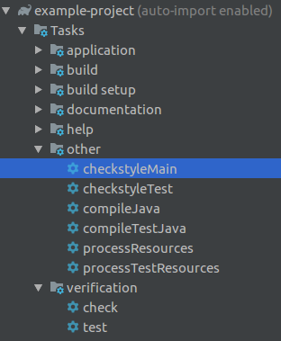
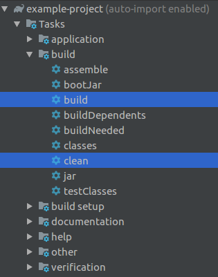
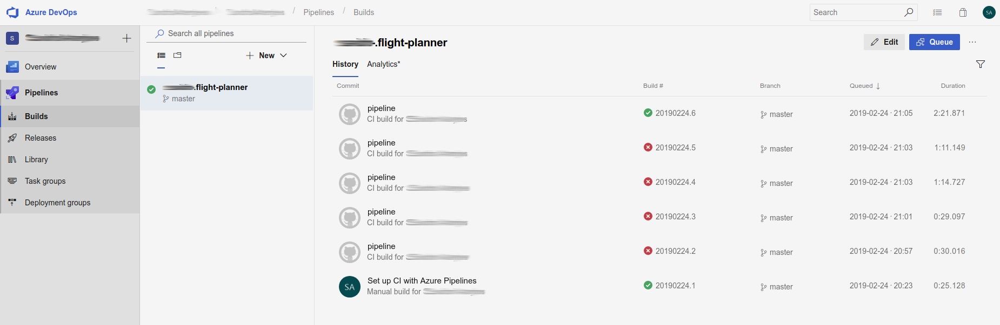

# Example Spring Boot project

## Creating the project

Generate your project at [start.spring.io](https://start.spring.io/), choose:

 - Gradle project
 - Java
 - Latest stable version (highest number without any suffixes)
 - use *codelex.io* as group
 - use appropriate name for your project
 - *jar* packaging

## Git

### Ignore files from Git

Your project should contain `.gitignore` file already, which contains information about which files to exclude from Git.

**Double check** it and make sure that `.idea` folder is excluded otherwise you may run into some problems if there are more than one people in your team.

### Create a repository

Create a new repository for your project at [github.com](http://github.com) and follow the instructions there to make your initial commit.

## Checkstyle

Add [checkstyle plugin](https://docs.gradle.org/current/userguide/checkstyle_plugin.html) to your project.

We will be working according to [./config/checkstyle](./config/checkstyle).

Make sure that you are using the latest version of the plugin, [see instructions](https://stackoverflow.com/questions/26548931/gradle-change-checkstyle-version)

After adding the plugin - `checkstyle` tasks for main & test sources must show up.

## Build

You can read more about building Java projects with Gradle [here](https://docs.gradle.org/current/userguide/building_java_projects.html).

To check if your project can be built execute `./gradlew clean build` command from the command line or just execute clean & build tasks from the IDE.

`build` task includes test & checkstyle execution by default.

## Automated build within your repository

### Setting up Azure pipelines

Visit [Azure pipelines @github.com/marketplace](https://github.com/marketplace/azure-pipelines) and complete free plan setup for your repository.

Copy [azure-pipelines.yml](./azure-pipelines.yml) & [Dockerfile](./Dockerfile) in the root of your repository.

### Checking build status

After each push your application will be built automatically, you can follow the progress at [dev.azure.com](https://dev.azure.com)

